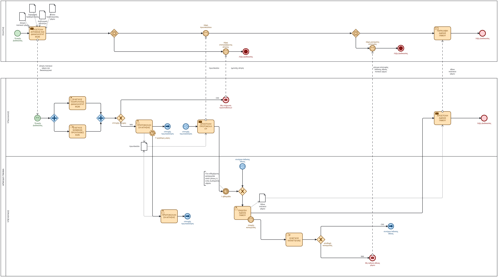

# bpmn-Issue-of-a-civil-marriage-licence
BPMN 2.0 process modeling for Civil Marriage License Issuance based on Greek public administration procedures

# Civil Marriage License Issuance – BPMN 2.0 Process Modeling

This repository contains a business process model for the **994264 Issuance of a Civil Marriage License (Έκδοση Άδειας Πολιτικού Γάμου)** in accordance with Greek public administration procedures ([mitos.gov.gr](https://mitos.gov.gr)).

The process captures end-to-end interactions between the **Citizen (Applicant)**, the **Municipal Front-Desk Clerk**, and the **Competent Marriage Affairs Department**.

---

## 📊 Process Preview

> The source `.bpmn` diagram is available in the root directory and can be visualized or edited using [Camunda Modeler](https://camunda.com/download/modeler/) or any standard BPMN 2.0 tool.

---

## 📁 Repository Structure

* `994264.bpmn` – Core BPMN 2.0 collaboration model
* `994264.png` – High-resolution export of the process workflow
* `README.md` – Project documentation and workflow breakdown

---

## 🔄 Workflow Breakdown

### 1. Citizen Pool (Applicant)
* **Application & Document Submission:** Transmits required certificates (Birth Certificates, IDs, Public Marriage Announcement notice).
* **Event-Based Decision Gateways:** Awaits asynchronous responses:
  * **Protocol Receipt:** Confirmation of successful initial validation.
  * **Application Return/Rejection:** Prompt notification if documents fail basic checks.
  * **License Delivery vs. Rejection:** Final retrieval of the approved Marriage License or refusal notification.

### 2. Public Authority Pool (Municipal Services)
* **Clerk (Υπάλληλος) – Initial Screening:**
  * Executes **parallel checks** for document completeness and legal prerequisite compliance.
  * Formal protocol assignment within standard administrative deadlines (7 working days).
* **Competent Department (Αρμόδιο Τμήμα) – Review & Issuance:**
  * Enforces a mandatory **1-week statutory waiting period** for public objections / impediments.
  * Evaluates third-party complaints (if submitted).
  * Generates and dispatches the official **Civil Marriage License**.

---

## 🛠️ Modeling Standards & Tools

* **BPMN 2.0 Notation:** Pools & Lanes, Message Flows, Parallel (+) & Exclusive (X) Gateways, Event-Based Gateways, Boundary Timer Events, and Data Objects.
* **Camunda Modeler:** Diagram creation, validation, and XML schema generation.
* **GitHub:** Version control and portfolio hosting.

---

## 🔗 Process Source

* Official Procedure Registry: [mitos.gov.gr](https://mitos.gov.gr)

---

## 👤 Author

Developed as an academic and professional portfolio project in **Business Process Management (BPM)**
